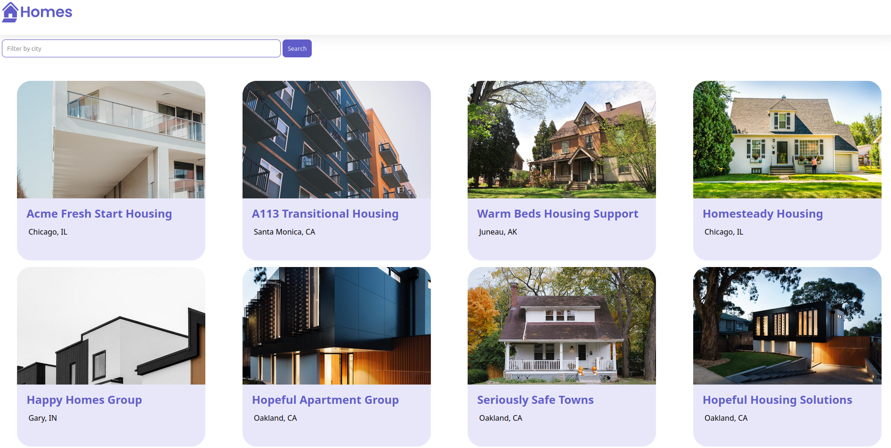

# ProjectHouse



This project was generated using [Angular CLI](https://github.com/angular/angular-cli) version 19.2.3.

## How to Run

1. Clone the repository.

2. Run npm install to install dependencies.

3. Run ng serve to start the development server.

4. Open your browser and navigate to http://localhost:4200.

Alternatively, you can use:
```bash
npm run start
```

## What I learned

In this app, I used some Angular features, such as:

- @Component

- @Input

- Built-in Control Flow for Loops (@for)

- Property Binding ([property]="value")

- Interpolation ({{ value }})